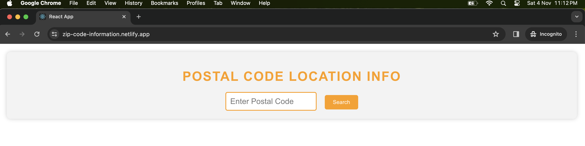
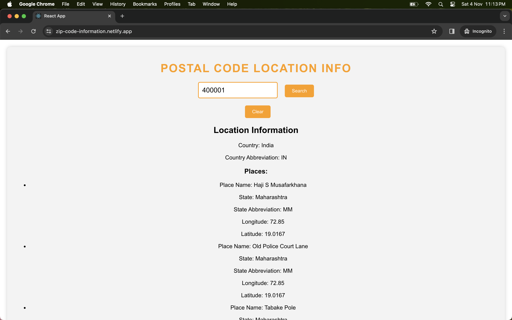

# ZIP Code Information App

This React app, developed by Pranav Chauhan, allows users to enter a postal code and retrieve location information. It's designed to provide a seamless experience with a clean and stylish interface.

## Features
- **Postal Code Input**: 
    Users can easily input their postal code.

- **Location Information Retrieval**: 
    The app fetches location data from an API and displays it.

- **Graceful Error Handling**: 
    In case of API errors, the app displays an informative error message.

- **Loading Indicator**: 
    Keep users informed with a loading indicator during data retrieval.

- **Clear Information Option**: 
    Users can reset the displayed information with a single click.

- **Stylish Design**: 
    The app is visually appealing, thanks to the use of CSS for a polished look.

## How to Use
1. Clone this repository to your local machine.
2. Navigate to the project folder and run `npm install` to install the necessary dependencies.
3. Start the app by running `npm start`.
4. Open your web browser and go to `http://localhost:3000` to access the app.

## Technologies Used
- React
- CSS (or specify your CSS framework)

## Credits
- Developed by Pranav Chauhan

## License
This project is open-source under the [MIT License](LICENSE).
